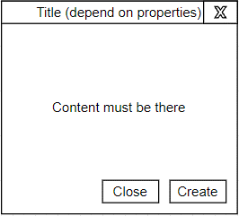

# EPAMLabTasks --- React
Repository for EPAM Laboratory Tasks
# EPAMLabTask React-1

You need to implement simple page with information about user.
The user has next data and should be stored as constant variable and passed as props into application:
```javascript
  {
    "id": 1,
    "name": "Leanne Graham",
    "username": "Bret",
    "email": "Sincere@april.biz",
    "address": {
      "street": "Kulas Light",
      "suite": "Apt. 556",
      "city": "Gwenborough",
      "zipcode": "92998-3874",
      "geo": {
        "lat": "-37.3159",
        "lng": "81.1496"
      }
    },
    "phone": "1-770-736-8031 x56442",
    "website": "hildegard.org",
    "company": {
      "name": "Romaguera-Crona",
      "catchPhrase": "Multi-layered client-server neural-net",
      "bs": "harness real-time e-markets"
    }
  }
```
You are free to implement different design (discuss it with mentors), but UX should be the following:


You need to create a separate repository. You can use npm or yarn as package manager. You can use boilerplate (like react-create-app) or write your own webpack config to build an app. You can use any way to style your app (CSS, SCSS, styled component, whatever you want). You can use Typescript if you want. Anyway, your package.json must include minimum 2 running scripts: start for running in dev mode and build for building your app (included in react-create-app from the box). You can discuss all ideas about folder structure and any additional requirements with your mentors

# EPAMLabTask React-2

You have to create request for albums data from https://jsonplaceholder.typicode.com/ and paste this information into you application inside <Content/> component from previous task.

No any strict rules for UI or UX, but you need paste this data like list items
Don’t use react hooks for this task (only classes available if you need side effects)

# EPAMLabTask React-3

You have to implement next things
1.	Rewrite classed components to functional components with hooks
2.	Add logic for clicking on album: you should load all photos from album and paste it into <Content/> component. 

So UX should be next: 
1.	Initial you load albums and paste it into <Content/> (it has to be done in previous task)
2.	After it you can click on album and load photos
3.	there is should be back button to go back to albums in case if you are on “photos” page (fells free to choose place for it)
 


# EPAMLabTask React-4

You have to add state management of your application with Redux
1.	You need to implement action creators for albums, photos
2.	You need to implement reducers for albums, photos, user
3.	You need to review you components and “connect” store with application
4.	You need to add buttons “Add album” and “Add photo” after last items in corresponding lists. Clicking on this buttons must add new items with hardcoded values 
IMPORTANT NOTE: Considering limitations in API that it doesn’t add new items into list of albums or photos (it’s only return “OK” status), you need to think about how you should save new items. I propose you to use special field in reducer for new items, created locally. Resulted list for components should combine items from API and local added items. But you can discus with you mentors and find more suitable solution if you want. The main target of this task – move out of components business logic with storing and creating items with Redux 

# EPAMLabTask React-5

You have to add forms for creating new album and photos
1. Instead if creating hardcoded albums and photos you need to show modal window with necessary fields. Modal window must be independent component and can be used separately with different content. UI must include minimum number of features (see the picture). Try to use features that we mentioned in lecture (context or renderProps for content, portal for placement of modal window, or your own ideas)/ Implement simple validation


 
2. Add ErrorBoundry to your application
3. As we can have a lot of items from API response, we need to have a way to go to bottom of page. So you need to add a control inside of <Content/> component that will scroll to bottom of page on click (any UI for this control)
Additional task: as we don’t touch topic how to implement custom hooks, try to implement:
1. hook to get previous value of props, state, etc 
usePrevious(value)
2. hook that will repeat behavior of componentDidUnmount lifecycle method useComponentDidUnmount(callback)

# EPAMLabTask React-6

You have to add routing into your application
1.	Login page. You should redirect to this page in case if user isn’t authorized (‘/login’). There is simple form for login and password (I suppose you to use “email” as login and “username” as password)
2.	Add logout button somewhere at the top of header, or in component for user (it’ s up to us to decide where it should be). At click on this button – reset auth for user
3.	/albums – public route for page with all available albums (you mustn’t show information about user there)
4.	/albums/:albumId – public route for page with album’s photos (you mustn’t show information about user there)
5.	/user/:userId – private route. Available only for authorited users. Information about user and list of albums that belong this user
6.	/user/:userId/albums/:albumId - private route. Available only for authorited users. Information about user and list of photos from album
7.	/, /home – for authorized user it’s /user/:userId, for unathorized - /albums
8.	If you try to go on private route without auth – it has to redirect to /login page
